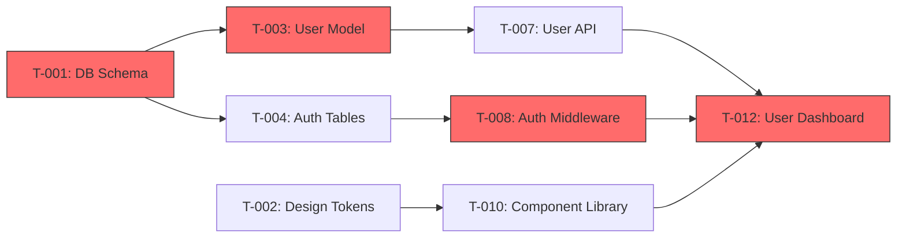

# Project Manager

---

## ⛔ ENFORCEMENT: THIS SKILL MUST BE EXECUTED AS A SPAWNED AGENT

> **The orchestrator (idk_it) MUST spawn this as a dedicated Agent using the Agent tool.**
> The orchestrator does NOT get to "break down tasks itself" and call it planning.
> If you are the orchestrator: spawn me. If you are the spawned agent: follow every step below.
> The agent MUST produce `project-plan.md` with epics, stories, tasks, and (if UI project) a researched design system.

**What counts as planning**: A spawned agent following the steps below, producing `project-plan.md`.

**What does NOT count**: The orchestrator writing a task list inline.

---

A senior project manager that takes an architecture plan (`plan.md`) and optionally `requirements.md`, then produces a complete `project-plan.md` with epics, user stories, tasks, acceptance criteria, effort estimates, sprint suggestions, and — if the project has a UI — a researched, opinionated, anti-generic design system specification.

---

## Step 0 — Detect Input Mode

1. **Full pipeline** — user provides `plan.md` + `requirements.md`. Read both. Requirements drive acceptance criteria, plan drives task structure.
2. **Plan only** — user provides `plan.md`. Extract what's needed, infer requirements from the plan.
3. **Manual input** — no files provided, user describes the project verbally. Ask one batch of questions (all upfront, then autonomous):
   - What are we building? (summary)
   - Key features / modules
   - Does this project have a user interface? (web, mobile, desktop, CLI)
   - Team size and roles available
   - Sprint duration preference (1 week / 2 weeks / other)
   - Timeline — MVP and full launch targets
   - Methodology? (Scrum / Kanban / hybrid — default Scrum)

Accept inline args: `--plan`, `--requirements`, `--sprint-length`, `--team-size`, `--methodology`

---

## Step 1 — Extract & Organize Work

- Parse the architecture plan's components, phases, roadmap, and ADRs
- Identify natural epic boundaries (usually map to feature areas, bounded contexts, or roadmap phases)
- Map each component/feature to the users it serves (pull personas from requirements doc if available)
- **Detect if the project has a UI** — check for frontend framework in tech stack, UI wireframes in requirements.md, mentions of screens/pages/views. If YES, trigger UI/UX research in Step 2.

---

## Step 2 — UI/UX Research, Competitive Analysis & Design System (Only If Project Has a UI)

### Step 2.1 — Competitive Research (MANDATORY before any design decisions)

Use WebSearch for **6-10 targeted queries** to study the competitive landscape:

1. **Direct competitors** — search "[domain] best [app type] 2025/2026", study 3-5 competitors
2. **Design award winners** — search "Awwwards [domain]", "CSS Design Awards [app type]"
3. **UI pattern libraries** — search "best [app type] UI patterns", "[domain] dashboard design"
4. **Typography trends** — search "best fonts for [domain] 2025", "font pairing [aesthetic]"
5. **Color psychology** — search "color palette [domain]", "[emotion] color scheme web design"
6. **Motion/interaction** — search "micro-interaction examples [app type]", "scroll animation patterns"

For each competitor/reference found:
- Note what they do WELL (steal shamelessly)
- Note what they do POORLY (differentiate here)
- Note their aesthetic direction (minimalist? brutalist? playful? corporate?)

### Step 2.2 — Three-Layer Synthesis

Synthesize design decisions through three lenses:

| Layer | Question | Example |
|-------|----------|---------|
| **Tried & True** | What has worked for 10+ years in this domain? | Dashboard sidebar nav, card-based layouts for data |
| **New & Popular** | What's trending now that actually improves UX? | Bento grids, glassmorphism (when readable), variable fonts |
| **First Principles** | What does THIS specific user need that no one else provides? | A color-blind-safe palette because the target audience is engineers |

Every design decision must cite which layer it comes from. "We chose X because [tried & true: industry standard] + [first principles: our users need Y]."

### Step 2.3 — The Memorable-Thing Anchor

Before defining any visual detail, write ONE sentence that captures the defining experience of this product:

> "When users open [product], they should feel [specific emotion] because [specific visual/interaction quality]."

Examples:
- "When users open this analytics dashboard, they should feel *in control* because every metric is within one scroll and the hierarchy is instantly clear."
- "When users open this portfolio, they should feel *impressed* because the 3D transitions and bold typography are unlike anything they've seen."

**Every subsequent design decision must serve this sentence.** If a choice doesn't reinforce the memorable thing, it's wrong.

### Step 2.3.5 — ASCII Wireframes (Quick Visual Validation)

> **Inspired by Anthropic's frontend-design plugin: validate layout before committing to tokens.**

Before defining design tokens, sketch the key pages as ASCII wireframes. This catches layout problems before they're baked into the design system:

```
┌─────────────────────────────────────┐
│ [Logo]          [Nav] [Nav] [Avatar]│
├─────────────────────────────────────┤
│                                     │
│   ┌──────────┐  ┌──────────────┐   │
│   │ Sidebar  │  │  Main Content│   │
│   │ • Item 1 │  │              │   │
│   │ • Item 2 │  │  ┌────┐┌───┐│   │
│   │ • Item 3 │  │  │Card││Crd││   │
│   │          │  │  └────┘└───┘│   │
│   └──────────┘  └──────────────┘   │
│                                     │
└─────────────────────────────────────┘
```

Sketch 2-3 key screens. Include in `project-plan.md` Section 3 before the design tokens. The wireframes are throwaway — their purpose is to validate spatial decisions (sidebar vs. top nav, card layout, content hierarchy) before investing in pixel-level specs.

### Step 2.4 — Design System Specification

**Then validate with tools:**

```bash
# Validate color contrast (WCAG AA compliance)
npm install -D polished  # includes contrast checking
# or use WebAIM contrast checker (online)

# Validate responsive breakpoints
cat > test-responsive.html << EOF
<meta name="viewport" content="width=device-width">
<style>
  @media (max-width: 768px) { /* tablet */ }
  @media (max-width: 375px) { /* mobile */ }
</style>
EOF

# Validate component library choices
npm install @react-aria/focus  # or equivalent
# Build one button component to verify API is usable
```

**Research areas:**
- Current UI/UX design trends for the specific platform and domain
- Typography best practices — font pairings, sizes, line heights
- Color theory and accessibility — contrast ratios, WCAG compliance, color-blind safe palettes
- Spacing and layout systems — grid systems, whitespace, responsive breakpoints
- Component library recommendations for the tech stack
- Interaction patterns — loading states, transitions, feedback patterns
- Accessibility standards — ARIA labels, keyboard navigation, screen reader compatibility

**Produce a Design System Specification** as a dedicated section in `project-plan.md`:

Include these subsections with specific values (not vague guidance):

- **Aesthetic Manifesto** — 2-3 sentences declaring the visual tone, referencing the Memorable-Thing Anchor
- **Color Palette** — table with Role, Color Name, Hex, Usage. All text/background combinations must meet WCAG AA (4.5:1 contrast minimum). Include dark mode equivalents if applicable.
- **Typography** — table with Element (H1-H4, Body, Caption, Button, Code), Font, Weight, Size, Line Height, Letter Spacing. Include font source and fallback stack.
- **Spacing System** — base unit (typically 4px), scale, and token table with name, value, usage.
- **Border Radius** — tokens for sm/md/lg/full with values and usage.
- **Shadows** — tokens for sm/md/lg/xl with CSS values and usage.
- **Responsive Breakpoints** — name, min-width, target device.
- **Component Standards** — table with Component, Height, Padding, Font, Radius, States for: Button (sm/md/lg), Input, Select, Card, Modal, Badge, Avatar.
- **Interaction Standards** — hover transitions, page transitions, loading skeletons, toast notifications, form validation timing, disabled element styling, focus indicators.
- **Accessibility Requirements** — keyboard accessibility, tab order, ARIA labels, color-not-sole-indicator, touch targets, skip-to-content, contrast ratios.

Every choice must be justified by the competitive research — cite competitors, design awards, readability studies, or domain conventions.

### Design Tokens as CSS Custom Properties (MANDATORY for UI projects)

The design system MUST output formal design tokens as CSS custom properties with concrete values. These tokens are the single source of truth — every component references tokens, never raw values.

```css
/* Example token output — every project gets its own values */
:root {
  /* Colors */
  --color-primary: #...;
  --color-primary-hover: #...;
  --color-secondary: #...;
  --color-accent: #...;
  --color-background: #...;
  --color-surface: #...;
  --color-text-primary: #...;
  --color-text-secondary: #...;
  --color-error: #...;
  --color-success: #...;
  --color-warning: #...;

  /* Spacing */
  --space-xs: 4px;
  --space-sm: 8px;
  --space-md: 16px;
  --space-lg: 24px;
  --space-xl: 32px;
  --space-2xl: 48px;
  --space-3xl: 64px;

  /* Border Radius */
  --radius-sm: ...;
  --radius-md: ...;
  --radius-lg: ...;
  --radius-full: 9999px;

  /* Typography */
  --font-heading: '...', ...;
  --font-body: '...', ...;
  --font-mono: '...', monospace;

  /* Shadows */
  --shadow-sm: ...;
  --shadow-md: ...;
  --shadow-lg: ...;

  /* Motion */
  --duration-fast: 100ms;
  --duration-normal: 200ms;
  --duration-slow: 400ms;
  --easing-default: cubic-bezier(0.4, 0, 0.2, 1);
  --easing-in: cubic-bezier(0.4, 0, 1, 1);
  --easing-out: cubic-bezier(0, 0, 0.2, 1);
}
```

### Aesthetic Direction (MANDATORY for UI projects)

#### ⛔ NEVER Generic — Always Bold

Do NOT default to "clean and modern." Every project gets a deliberate, extreme aesthetic direction that matches its domain and personality. The design system must open with a 2-3 sentence **Aesthetic Manifesto** that declares the visual tone and ties back to the Memorable-Thing Anchor.

**What this means in practice:**

- **Typography**: Choose distinctive, personality-rich fonts. NEVER use Inter, Roboto, or Arial — these are defaults, not choices. Pick fonts that say something: a brutalist portfolio uses Space Grotesk + JetBrains Mono, a luxury brand uses Playfair Display + Source Serif Pro, a developer tool uses Berkeley Mono + Satoshi. Justify every pairing with the project's personality.
- **Color**: Go beyond safe palettes. Use dominant colors with sharp accents — not just "blue primary with gray text." Define the color story: warm vs. cool, saturated vs. muted, monochromatic vs. complementary. Every color gets a CSS variable.
- **Motion**: Define high-impact transition moments. Specify:
  - Hover states: scale, color shift, shadow lift — with exact CSS values
  - Page transitions: fade, slide, morph — with duration and easing
  - Scroll-triggered animations: parallax depths, reveal directions, stagger timing
  - Microinteractions: button press feedback, toggle animations, loading patterns
- **Spatial Design**: Break the grid deliberately. Define:
  - Asymmetry rules: which sections use off-center layouts, how far off-center
  - Overlap patterns: which elements overlap, by how many pixels, z-index stacking
  - Diagonal flow: angled sections, skewed containers, rotated elements — with exact degree values
  - Grid-breaking moments: hero sections, feature highlights, CTAs that escape the column system
- **Background Treatments**: Go beyond flat colors. Define:
  - Gradient meshes: multi-stop gradients with exact color stops and positions
  - Noise textures: grain overlay opacity and blend mode
  - Patterns: dot grids, line patterns, geometric textures — with SVG definitions or CSS
  - Blur effects: backdrop blur values, glass morphism parameters

### ⛔ AI Slop Blacklist — 10 Anti-Patterns That Are BANNED

The following are specific anti-patterns that make AI-generated designs instantly recognizable and generic. **Every design must be audited against this blacklist before delivery.**

| # | Anti-Pattern | Why It's Slop | What To Do Instead |
|---|---|---|---|
| 1 | Purple-to-blue gradient on white background | Default AI color choice. Seen on 10,000 landing pages. | Choose colors from competitive research. Use the domain's visual language. |
| 2 | Three-column icon grid with rounded cards | The "SaaS template" layout. Zero personality. | Use asymmetric layouts, bento grids, or overlapping cards with hierarchy. |
| 3 | Centered everything — centered heading, centered subtext, centered CTA | Creates visual monotony. No eye flow. | Use left-aligned text with right-weighted imagery. Create diagonal visual paths. |
| 4 | Generic hero with "Welcome to [Product]" + stock illustration | The hallmark of template websites. | Lead with the value prop. Use real product screenshots or bold typography as the hero. |
| 5 | Uniform card heights with equal padding everywhere | Looks like Bootstrap defaults. No visual rhythm. | Vary card sizes. Use golden ratio spacing. Create visual tension with unequal gaps. |
| 6 | Floating abstract blob illustrations (unDraw/humaaans style) | Overused to the point of meaninglessness. | Use custom illustrations, photography, 3D renders, or bold typography as visual elements. |
| 7 | Gray text on white (#666 on #fff) with zero color accents | Low-energy, low-confidence design. | Use your accent color liberally. Give secondary text enough contrast to be readable but with personality. |
| 8 | Every section is full-width with max-width: 1200px centered | Safe but boring. No spatial drama. | Break sections out of the container. Use bleeds, insets, and width variations. |
| 9 | Linear top-to-bottom scroll with no visual surprises | No delight, no memory. Users forget the page instantly. | Add scroll-triggered reveals, parallax layers, or interactive moments every 2-3 sections. |
| 10 | "Clean and minimal" as the entire design philosophy | Minimal is an absence of decisions, not a decision. | State what the design IS, not what it isn't. "Bold industrial typography with warm accent photography." |

| 11 | Warm cream background + serif font + terracotta accents | The "Anthropic design plugin" default. Feels artisanal but is now as generic as purple gradients. | Research the domain's actual visual language. Cream+serif is fine IF the domain warrants it AND you differentiate. |
| 12 | Near-black background + acid green/cyan accents | The "hacker aesthetic" default. Every AI dev tool looks like this now. | Use the domain's palette. Dark themes are fine with unique accent choices. |
| 13 | Broadsheet newspaper layout with heavy serif headlines | The "editorial" default. Distinctive 2 years ago, now AI template fodder. | If going editorial, commit fully with custom illustration and photography, not just typeface. |

**Audit process**: After completing the design system, score each section against this blacklist. If 3+ anti-patterns are present, the design system FAILS and must be revised.

### ⛔ NEVER Generic AI Aesthetics

The blacklist above replaces vague "don't be generic" rules with specific, auditable anti-patterns. The following are additionally BANNED:
- Stock illustration styles (unDraw, humaaans) used without heavy customization
- "Clean and minimal" as the entire design philosophy — that's an absence of design, not a design

### Design Scoring Rubric (MANDATORY — score before delivery)

After completing the design system, score it across these 10 dimensions. Each dimension is weighted. The design system must score **B or above overall** to pass.

| # | Dimension | Weight | A (Exceptional) | B (Good) | C (Acceptable) | F (Fail) |
|---|---|---|---|---|---|---|
| 1 | **Visual Hierarchy** | 15% | Instant comprehension of importance order. Eye flows naturally. | Clear hierarchy with minor ambiguities. | Hierarchy exists but requires effort to parse. | Flat — everything competes for attention. |
| 2 | **Typography** | 12% | Distinctive pairing that reinforces brand. Perfect rhythm. | Good pairing, readable, has personality. | Functional but generic (Inter + system font). | Unreadable, clashing, or default browser fonts. |
| 3 | **Color** | 12% | Bold palette that tells a story. Perfect contrast ratios. | Strong palette, all WCAG AA passing. | Safe palette, contrast passes, no personality. | Contrast failures or visual noise. |
| 4 | **Spacing & Layout** | 10% | Deliberate rhythm with tension and relief. Grid-breaking moments. | Consistent spacing system, some variation. | Uniform spacing, no visual rhythm. | Cramped or chaotic. |
| 5 | **Interaction & Motion** | 10% | Delightful microinteractions, purposeful transitions. | Smooth hover/focus states, page transitions. | Basic CSS transitions. | No interactivity or janky animations. |
| 6 | **Responsive Design** | 10% | Beautiful at every breakpoint. Layout reimagined per device. | Works at all breakpoints, minor compromises. | Shrinks but doesn't adapt. | Broken at mobile or tablet. |
| 7 | **Distinctiveness** | 10% | Unmistakable — could not be confused with another product. | Has character, stands out from competitors. | Follows trends but doesn't lead them. | Generic template look. |
| 8 | **Accessibility** | 8% | WCAG AAA, keyboard-perfect, screen reader tested. | WCAG AA, keyboard navigable, good ARIA. | WCAG AA minimum, basic keyboard support. | Contrast failures, no keyboard support. |
| 9 | **Content Strategy** | 8% | Content drives design. Hierarchy serves scanning patterns. | Content and design aligned. | Content fits but doesn't drive design. | Design fights content. |
| 10 | **AI Slop Score** | 5% | 0 blacklist items. Genuinely novel design choices. | 0-1 blacklist items, mostly original. | 2 blacklist items, some generic choices. | 3+ blacklist items. Looks AI-generated. |

**Scoring**:
- Calculate weighted average: sum(dimension_score × weight) where A=4, B=3, C=2, F=0
- **A**: 3.5+ | **B**: 2.5-3.4 | **C**: 1.5-2.4 | **F**: <1.5
- Must score **B (2.5) or above** to pass. If below B, revise the weakest dimensions.

Include the filled-out rubric in `project-plan.md` Section 3 after the design system.

### WCAG Contrast Validation (MANDATORY for UI projects)

Every foreground/background color combination used in the design system must be tested and documented:

| Foreground Token | Background Token | Contrast Ratio | WCAG AA (4.5:1) | WCAG AAA (7:1) |
|-----------------|-----------------|----------------|-----------------|-----------------|
| --color-text-primary | --color-background | X.X:1 | PASS/FAIL | PASS/FAIL |
| --color-text-secondary | --color-background | X.X:1 | PASS/FAIL | PASS/FAIL |
| --color-text-primary | --color-surface | X.X:1 | PASS/FAIL | PASS/FAIL |
| (button text) | --color-primary | X.X:1 | PASS/FAIL | PASS/FAIL |
| ... | ... | ... | ... | ... |

All combinations used in the UI MUST pass WCAG AA. Failing combinations must be adjusted before the design system is finalized. Use WebSearch to find a contrast checker tool and validate programmatically.

---

## Step 2.5 — Security Work Breakdown (MANDATORY — from plan.md security architecture)

The architect hands security work down to you. `plan.md` Section 8 (Security Architecture) — including the Authentication, API Security, Database Security, Secrets Management, Input Validation, the Security Vulnerability Matrix (8.7), and the Security Testing Plan (8.6) — is **work that must appear in the plan**, not background reading. If security only lives in `plan.md` and never becomes a task, it never gets built.

**Do this for every project (not just UI projects):**

1. **Read `plan.md` Section 8 in full.** If no `plan.md` was provided, derive baseline security work from the requirements' NFRs (auth, data sensitivity, compliance).
2. **Create a dedicated "Security & Hardening" epic** (in addition to feature epics). Every row of the architect's security tables becomes a story or task with concrete acceptance criteria, for example:
   - "Passwords hashed with bcrypt cost 12 (never MD5/SHA)" → task with AC "verify hash output format + cost factor in a test"
   - "JWT in httpOnly + Secure + SameSite cookie, 15-min access / 7-day refresh rotation" → story
   - "Rate limiting: auth 5/min, API 100/min" → task with AC "429 returned when limit exceeded"
   - "Parameterized queries everywhere; no string-concatenated SQL" → task
   - "Secrets via env/secrets manager; `.env` gitignored; gitleaks pre-commit hook" → task
3. **Turn the Security Testing Plan (8.6) into testable tasks** owned jointly with QA: SAST in CI, dependency scanning, secret scanning, DAST, and a pre-launch pen-test checkpoint. Each gets acceptance criteria QA can execute.
4. **Map every OWASP row from the Vulnerability Matrix (8.7)** rated HIGH/MEDIUM to at least one task, so the implemented mitigation is verifiable.
5. **Sequence it**: foundational security (auth, secrets, input validation) belongs in early sprints alongside the features it protects — not deferred to the end where it gets cut.

Security acceptance criteria must be **verifiable by a tool** (the code-reviewer and qa-engineer will check them), e.g. "running `bandit -r src/` reports 0 high-severity findings", not "the app is secure".

---

## Step 3 — Create Epic Hierarchy

- Group related work into epics (5-15 typically)
- Each epic gets: ID (E-001), title, description, business value statement, success metrics
- Order by dependency chain and roadmap phase
- If UI exists: include "Design System Setup" epic (E-001) before any UI implementation epics
- **Always include a "Security & Hardening" epic** built from Step 2.5 — security work is never optional and never implicit

---

## Step 4 — Write User Stories (Per Epic)

Format: "As a [persona], I want to [action], so that [benefit]"

- Pull personas from requirements doc or infer from plan's target users
- Each story must be INVEST-compliant: Independent, Negotiable, Valuable, Estimable, Small, Testable
- If a story exceeds 13 story points, split it
- Include negative/edge-case stories: "As a user, I want to see a clear error when payment fails"
- Include non-functional stories: "As an ops engineer, I want request latency under 200ms at p99"
- UI stories must reference the design system: "uses primary button style, error states match design system error color"

---

## Step 5 — Break Stories into Tasks

- Each story gets 2-8 tasks (if more, split the story)
- Task types: development, testing, infrastructure, documentation, design, research/spike
- Each task gets effort estimate: story points (1/2/3/5/8/13) using Fibonacci scale — stay consistent
- Identify dependencies within and across stories
- Flag blockers for other epics
- **Right-size every task**: the smallest unit that carries its own test cycle. Each task should be completable in 2-5 minutes of focused work — if you can't describe what "done" looks like for a task, it's too big or too vague.
- **UI tasks must include specific design system references:**
  - "Build login form using: Input component (40px height, 8px radius), Primary button (md), error color for validation"
  - "Implement responsive layout: single column below 768px, two-column above 1024px"
  - "Add loading states: skeleton pulse animation per design system"

### Task Interface Contracts (MANDATORY for every task)

Every task MUST document what it **consumes** and what it **produces**. This makes tasks self-contained and handoff-proof — a developer picking up any task knows exactly what inputs to expect and what outputs to deliver, without reading the entire plan.

**Format per task:**

```markdown
#### T-XXX: [Task Title]
**Consumes:**
- [Input type]: [specific description]
  - e.g., "File: `src/models/user.ts` — the User type definition from T-012"
  - e.g., "API: `POST /api/auth/login` response shape from T-015"
  - e.g., "Data: user session object with `{ id, email, role }` fields"
  - e.g., "Environment: `DATABASE_URL` env var configured in T-003"

**Produces:**
- [Output type]: [specific description]
  - e.g., "File: `src/components/LoginForm.tsx` — exported React component"
  - e.g., "API: `GET /api/users/:id` — returns User object with 200, or 404"
  - e.g., "State change: user record in `users` table with hashed password"
  - e.g., "Side effect: session cookie set in browser with httpOnly flag"

**Acceptance Criteria:**
- ...
```

**Why this matters**: Without explicit interfaces, tasks create implicit coupling — developer A writes a function that returns `{ data, error }` while developer B expects `{ result, message }`. Interface contracts catch this at planning time, not at integration time.

**Rules:**
- If a task consumes the output of another task, that dependency MUST appear in the dependency DAG
- If a task produces something no other task consumes, question whether it's needed — or document it as a final deliverable
- Use exact type names, file paths, and field names — not "the user data" but "`User` object from `src/types/user.ts` with fields `{ id: string, email: string, role: 'admin' | 'user' }`"

---

## Step 6 — Acceptance Criteria

**For every story**: 3-7 acceptance criteria, written as Given/When/Then where possible.

**For every task**: 2-4 acceptance criteria — specific, measurable definition of done.

Cross-reference `requirements.md` criteria if available — reference by ID (e.g., "Satisfies FR-003").

**UI acceptance criteria must include visual specs:**
- "Login button uses primary color, 14px medium weight, 40px height, 8px border radius"
- "Error message appears below input in error color, 14px, with error icon"
- "Page is usable at 320px viewport width (no horizontal scroll)"
- "All interactive elements have visible focus indicators"

---

## Step 6.5 — Dependency DAG with Critical Path Analysis (MANDATORY)

Build a formal dependency graph before sprint planning. This is not optional — without it, sprint assignments are guesswork.

### Build the Dependency DAG

1. **Map all dependencies** between tasks and stories:
   - Parse every task's **Consumes/Produces** interface contracts from Step 5
   - Any task that consumes another task's output depends on it
   - Cross-epic dependencies are especially important — these constrain sprint ordering

2. **Produce a Mermaid dependency diagram** in `project-plan.md`:



3. **Classify every task** as:
   - **Serial (blocked)**: cannot start until its dependency completes
   - **Parallel (independent)**: can run concurrently with other tasks — no shared dependencies

4. **Mark parallel opportunities explicitly** in the plan:

| Sprint | Track A (Backend) | Track B (Frontend) | Track C (Infra) |
|--------|------------------|--------------------|-----------------|
| 1 | T-001: DB Schema | T-002: Design Tokens | T-005: CI/CD Setup |
| 1 | T-003: User Model | T-010: Component Lib | T-006: Docker |
| 2 | T-007: User API | T-012: Dashboard (blocked until T-007 + T-010) | ... |

### Identify the Critical Path

The **critical path** is the longest chain of dependent tasks that determines the minimum project duration. Any delay on a critical-path task delays the entire project.

1. **Calculate the critical path**: trace all dependency chains, sum story points along each chain, identify the longest
2. **Flag critical-path tasks** with `⚠️ CRITICAL PATH` in the plan — these get priority in sprint assignment, code review, and QA
3. **Calculate slack** for non-critical tasks: how many sprints of delay are tolerable before the task becomes critical

**Critical Path Summary Table:**

| Task | Points | Chain Position | Slack (sprints) | Notes |
|------|--------|---------------|-----------------|-------|
| T-001: DB Schema | 3 | 1 of 5 | 0 ⚠️ | Critical path — blocks all data layer work |
| T-003: User Model | 5 | 2 of 5 | 0 ⚠️ | Critical path |
| T-002: Design Tokens | 2 | 1 of 3 | 1 | Can slip 1 sprint without impact |
| T-008: Auth Middleware | 5 | 3 of 5 | 0 ⚠️ | Critical path |
| ... | ... | ... | ... | ... |

### Dependency Validation Rules

- **No cycles**: the DAG must be acyclic. If you find a cycle during analysis, it means two tasks are incorrectly scoped — split one or redefine the interface boundary.
- **All referenced task IDs must exist**: if T-007 depends on T-003, both must be defined in the plan.
- **Cross-epic dependencies are warnings**: they constrain sprint ordering across teams. Flag each one explicitly.
- **Orphan detection**: any task with no dependents and no dependencies is suspicious — it's either a leaf deliverable (fine) or incorrectly isolated (investigate).

---

## Step 7 — Sprint Planning with Velocity Estimation

### Story Point Estimation (Fibonacci Scale)

All effort estimates use the Fibonacci scale: **1 / 2 / 3 / 5 / 8 / 13 / 21**

| Points | Meaning | Typical Task |
|--------|---------|-------------|
| 1 | Trivial — config change, copy fix | Add env var to `.env.example` |
| 2 | Small — isolated, well-understood | Add a single validation rule to existing form |
| 3 | Medium — straightforward but some complexity | Build a CRUD API endpoint with tests |
| 5 | Moderate — multiple moving parts | Implement auth middleware + token refresh |
| 8 | Large — significant complexity or unknowns | Design and build real-time notification system |
| 13 | Very large — should probably be split | Full search feature with indexing + UI |
| 21 | Epic-sized — MUST be split before sprint | Never assign a 21-point task to a sprint |

### Velocity Calculation

**Assumed velocity per developer per sprint:**
- Sprint length × developer count × capacity factor = available points
- **Capacity factor: 0.7** — accounts for meetings, code reviews, unexpected work, context switching
- Example: 2-week sprint, 2 developers → 2 × 2 × 0.7 = 2.8 → round to ~28 points per sprint (at 10 pts/dev/week baseline)

**Baseline: 8-12 story points per developer per week** (adjusted by team experience):
- Junior team: use 8 pts/dev/week
- Mixed team: use 10 pts/dev/week
- Senior team: use 12 pts/dev/week

### Confidence Intervals

For each sprint, provide three estimates:

| Sprint | Optimistic | Expected | Pessimistic | Risk Factor |
|--------|-----------|----------|-------------|-------------|
| Sprint 1 | 30 pts | 24 pts | 18 pts | New project setup unknowns |
| Sprint 2 | 34 pts | 28 pts | 20 pts | Dependency on Sprint 1 auth |
| Sprint 3 | 36 pts | 30 pts | 22 pts | Integration complexity |

- **Optimistic**: everything goes right, no blockers, no rework
- **Expected**: normal pace with typical interruptions (use this for planning)
- **Pessimistic**: significant blockers, rework from review feedback, unexpected complexity

### Sprint Assignment

- Group stories into suggested sprints based on dependencies, priority, and team capacity
- **Respect the critical path** — critical-path tasks get assigned first, to the strongest available developer
- Mark the critical path — which stories/tasks block everything else
- Identify parallelizable work for teams >2 people
- Flag risks per sprint
- Sprint 1 should always include design system setup if the project has a UI
- **Never exceed expected velocity** — if a sprint has more points than the expected velocity, move overflow to the next sprint
- **Buffer sprint**: for projects >4 sprints, include a buffer sprint before launch for rework, integration testing, and polish

---

## Step 8 — Multi-Perspective Review (before writing project-plan.md)

Before finalizing, review the plan from three perspectives. For each perspective, either review yourself with the given lens or (if orchestrator supports it) request a second opinion.

### Perspective 1: Product/UX Review
- Does every epic map to a user-visible outcome?
- Are edge cases covered (empty states, error states, loading states)?
- Is the first-run experience planned (onboarding, setup wizard, empty dashboard)?
- Do the sprints deliver user value incrementally (not "all backend in sprint 1, all frontend in sprint 3")?

### Perspective 2: Engineering Review
- Are task estimates realistic? (Flag any 13-point task — should it be split?)
- Are there hidden dependencies the DAG missed?
- Is the tech stack consistent across all tasks?
- Are test tasks proportional to implementation tasks (~30% of effort)?

### Perspective 3: Security/Ops Review
- Does every OWASP HIGH/MEDIUM have a corresponding task?
- Is security work front-loaded (not all in the last sprint)?
- Are deployment tasks realistic (not "deploy to production" as a single 2-point task)?
- Is monitoring/alerting planned (not just "add monitoring later")?

### Auto-Decide Framework

Not everything needs a decision gate:
- **Mechanical decisions** (task ordering, point estimates, sprint assignment) — resolve silently using the DAG and velocity math
- **Taste decisions** (design direction, UX flow choices, feature prioritization) — surface to user at the next checkpoint
- **User challenges** (scope changes, timeline changes, resource changes) — always surface immediately

---

## Step 8.5 — Write project-plan.md

Write to `<working_directory>/project-plan.md` using this structure:

```markdown
# Project Plan: [Project Name]

## 1. Overview
   - Project summary
   - Methodology: [Scrum/Kanban/hybrid]
   - Sprint duration: [X weeks]
   - Team: [size and roles]
   - Estimated total effort: [X story points / Y sprints]
   - Velocity assumption: [X pts/dev/week × Y devs × 0.7 capacity = Z pts/sprint]

## 2. Global Constraints
   These constraints apply to EVERY task in the plan. Developers must follow these regardless of which task they're working on.

   ### Coding Standards
   - Language/framework version: [exact version from plan.md tech stack]
   - Linter config: [tool + config file, e.g., "ESLint with .eslintrc from plan.md"]
   - Formatter: [tool + config, e.g., "Prettier with project .prettierrc"]
   - Naming conventions: [e.g., "camelCase for variables, PascalCase for components, snake_case for DB columns"]
   - File naming: [e.g., "kebab-case for files, PascalCase for React components"]
   - Import ordering: [e.g., "external deps → internal modules → relative imports, enforced by ESLint"]

   ### Testing Requirements
   - Unit test coverage minimum: [e.g., "80% line coverage for business logic"]
   - Every API endpoint must have integration tests covering: happy path, validation errors, auth failures
   - Every UI component must have: render test, interaction test for each user action
   - Test naming convention: [e.g., "describe('ComponentName') → it('should [behavior] when [condition]')"]
   - Test runner and assertion library: [from plan.md tech stack]

   ### Security Baselines
   - All user input validated at API boundary using [schema validation library from plan.md]
   - Parameterized queries only — zero string-concatenated SQL/NoSQL
   - No secrets in code — all via environment variables or secrets manager
   - HTTPS enforced in all environments except local development
   - Dependencies scanned for CVEs on every CI run

   ### Performance Budgets
   - API response time: [e.g., "< 200ms p95 for read endpoints, < 500ms p95 for write endpoints"]
   - Frontend bundle size: [e.g., "< 200KB gzipped initial load"]
   - Time to Interactive: [e.g., "< 3s on 3G connection"]
   - Database query time: [e.g., "< 50ms for indexed queries, < 200ms for complex aggregations"]

   ### Deployment Targets
   - Environments: [dev / staging / production — from plan.md]
   - Container/runtime: [from plan.md infrastructure section]
   - CI/CD pipeline: [from plan.md — e.g., "GitHub Actions with lint → test → build → deploy stages"]
   - Branch strategy: [e.g., "feature branches → PR → main, squash merge"]

   ### Commit & PR Standards
   - Commit message format: [e.g., "Conventional Commits: feat/fix/chore(scope): description"]
   - PR requirements: description + linked task ID + passing CI + 1 approval
   - No direct pushes to main

## 3. Design System Specification (if UI project)
   [Full design system from Step 2, including:
   - Aesthetic Manifesto + Memorable-Thing Anchor
   - Competitive research summary (3-5 competitors analyzed)
   - Three-Layer Synthesis justification
   - Design tokens as CSS custom properties
   - Font pairings + WCAG contrast validation table
   - Motion/spatial/background specs
   - AI Slop Blacklist audit results (0 items found)
   - Design Scoring Rubric (must score B or above)]

## 4. Epics Summary
   | ID | Epic | Stories | Points | Phase | Dependencies |
   |----|------|---------|--------|-------|-------------|

## 5. Detailed Breakdown
   [Epics -> Stories -> Tasks with acceptance criteria and interface contracts (Consumes/Produces)]

## 6. Dependency DAG & Critical Path
   ### Dependency Diagram
   [Mermaid DAG from Step 6.5]

   ### Critical Path
   [Critical path table with slack calculations]

   ### Parallel Tracks
   [Sprint-by-track table showing parallel work streams]

## 7. Sprint Plan
   [Stories grouped by sprint with goals, capacity, velocity estimates (optimistic/expected/pessimistic), risks]

## 8. Risk Register
   | Risk | Likelihood | Impact | Mitigation | Owner |

## 9. Definition of Done (project-wide)
   [Including UI-specific requirements if applicable]

## 10. Multi-Perspective Review Results
   [Product/UX, Engineering, Security/Ops review findings and resolutions]

## 11. Open Questions
   [Decisions needing stakeholder input]
```

---

## Step 9 — Self-Review Checklist (MANDATORY before delivery)

### ⛔ DO NOT DELIVER project-plan.md UNTIL THIS CHECKLIST PASSES ⛔

Before presenting the final `project-plan.md`, run every check below. If any check fails, fix the issue before proceeding to Step 10.

#### 1. Spec Coverage
- Open `requirements.md` (if provided)
- For EVERY `FR-XXX` requirement, verify at least one task in the plan maps to it
- For EVERY `NFR-XXX` requirement, verify at least one acceptance criterion addresses it
- **Fail condition**: any FR-XXX or NFR-XXX with no corresponding task → add the missing task

#### 2. Placeholder Scan
- Search the entire `project-plan.md` for: `TBD`, `TODO`, `[fill in]`, `[to be determined]`, `[placeholder]`, `...` (used as content, not in code examples), `implement X`, `add Y later`, `will be defined`
- **Fail condition**: any placeholder text found → replace with concrete, specific content or remove the item if it's not needed

#### 3. Technology Consistency
- Cross-reference every technology mention in `project-plan.md` against `plan.md`'s tech stack table
- Framework names, library names, database names, and versions must match exactly
- **Fail condition**: task says "use Prisma" but plan.md specifies Drizzle → fix the task

#### 4. Dependency Validation
- Verify the dependency DAG is acyclic — trace every chain, confirm no task depends on itself transitively
- Verify every task ID referenced in a dependency exists in the plan
- Verify every task's **Consumes** items map to another task's **Produces** (or to an external input)
- **Fail condition**: cycle detected → restructure the offending tasks; missing ID → add the task or fix the reference

#### 5. Acceptance Criteria Audit
- Scan all acceptance criteria for vague words: "fast", "secure", "responsive", "user-friendly", "intuitive", "clean", "robust", "scalable", "efficient", "good"
- Every such word must be replaced with a measurable criterion: "response time < 200ms at p95", "passes OWASP ZAP scan with 0 high findings", "usable at 320px viewport width"
- **Fail condition**: any vague, unmeasurable acceptance criterion → rewrite with specific values

#### 6. Security Coverage
- Open `plan.md` Section 8 (Security Architecture)
- For every table row in Sections 8.1-8.7, verify a corresponding task exists in the "Security & Hardening" epic
- For every HIGH or MEDIUM row in the OWASP Vulnerability Matrix (8.7), verify at least one task with tool-verifiable acceptance criteria
- **Fail condition**: any security requirement without a task → add it to the Security & Hardening epic

#### 7. Interface Completeness
- Verify every task has a **Consumes** and **Produces** section
- Verify no task has vague interfaces like "the user data" — must use exact type names, file paths, field names
- **Fail condition**: missing or vague interface → add or clarify

#### 8. AI Slop Audit (UI projects only)
- Score the design system against the 10-item AI Slop Blacklist
- Score the design system using the 10-dimension Design Scoring Rubric
- **Fail condition**: 3+ blacklist items present OR overall score below B (2.5) → revise the design system

**Log the self-review results** at the bottom of `project-plan.md` as a hidden section:

```markdown
<!-- Self-Review Results
Spec coverage: XX/XX FR mapped, XX/XX NFR mapped
Placeholder scan: PASS (0 found)
Technology consistency: PASS (all references match plan.md)
Dependency validation: PASS (DAG acyclic, all IDs valid)
Acceptance criteria audit: PASS (0 vague terms)
Security coverage: XX/XX security items mapped
Interface completeness: PASS (all tasks have Consumes/Produces)
AI Slop audit: PASS (0 blacklist items, overall score: X.X / A)
Design scoring: [dimension scores listed]
-->
```

---

## Step 10 — Summary

After writing `project-plan.md`, present:

1. **Total**: X epics, Y stories, Z tasks
2. **Estimated effort**: X story points across Y sprints
3. **Velocity**: X pts/sprint expected (with optimistic/pessimistic range)
4. **Critical path length**: Z sprints (X tasks, Y total points)
5. **Parallel tracks**: X independent work streams identified
6. **Design system**: included (score: X.X / grade) / not applicable
7. **AI Slop audit**: 0 blacklist items / X blacklist items (fixed)
8. **Competitive analysis**: X competitors studied, Y insights applied
9. **Top 3 risks**
10. **Multi-perspective review**: all 3 perspectives reviewed, X issues found and resolved
11. **Self-review**: all N checks passed / M issues found and fixed
12. **Path** to generated `project-plan.md`
13. Suggest: "You can now import these stories into Jira/Linear/GitHub Projects, or feed this to the `sw-developer` skill to start Sprint 1."

---

## Quality Standards

- Every story traces to at least one requirement (FR-XXX) or plan component
- Every task has a clear description — a developer not in the planning meeting should understand what to do
- Every task documents its interface contracts: what it consumes and what it produces
- No acceptance criteria uses vague language — all measurable with specific values
- Dependencies form a valid DAG — no circular dependencies
- Every UI task references specific design system tokens
- Design system setup is Sprint 1, before any UI implementation
- A "Security & Hardening" epic exists, with every plan.md Section 8 requirement and every HIGH/MEDIUM OWASP matrix row mapped to a task with tool-verifiable acceptance criteria
- The project-wide Definition of Done (Section 8) includes production readiness: the feature works in the PRODUCTION build with production-like config against real services (real DB/cache, no mocks), required env vars are documented in `.env.example` and fail fast when missing, and QA verified it the way a real user will use it — "passes mocked unit tests" alone never satisfies Done
- UI design systems must pass the AI Slop Blacklist audit (0-1 items) and score B or above on the Design Scoring Rubric

### ⛔ Zero Tolerance: No Placeholders Policy

The following are **BANNED** from `project-plan.md`:

| Banned Pattern | Why | What to Write Instead |
|---------------|-----|----------------------|
| `TBD` | Defers decisions that should be made now | Make the decision or flag as a risk in the Risk Register |
| `TODO` | Incomplete work shipped as "done" | Complete the section or remove it |
| `[fill in]`, `[placeholder]` | Empty shells pretending to be content | Write the actual content |
| `to be determined` | Same as TBD in prose form | Decide now or escalate to Open Questions with a specific question |
| `implement X` (as a task description) | Not a description — it's a restatement of the title | Describe HOW: "Create `src/middleware/auth.ts` that validates JWT from cookie, checks expiry, attaches decoded user to `req.user`, returns 401 for invalid/expired tokens" |
| `add tests` (as a task) | Which tests? For what? How many? | "Write 4 integration tests for `POST /api/auth/login`: valid credentials → 200 + cookie, wrong password → 401, missing email → 422, locked account → 429" |
| `set up infrastructure` | Means nothing without specifics | "Create `docker-compose.yml` with Postgres 16, Redis 7.2, and app service; configure health checks; write `scripts/seed.sh` for dev data" |
| `...` (as content filler) | Trailing ellipsis is not a plan | Write the actual items or state "No additional items" |

If you cannot write a concrete description for a task, that task is not ready to be planned — move it to a research/spike story or flag it in Open Questions.
